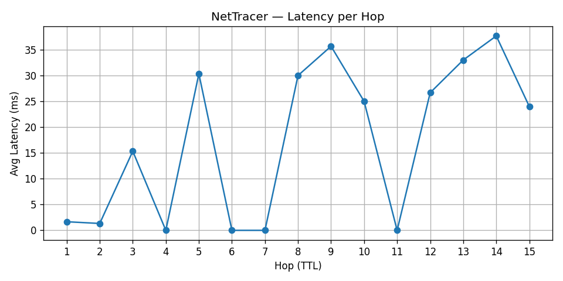

# net-tracer

NetTracer is a command-line traceroute that prints the hops to a host with their average latency and saves a per-hop latency chart. It sends ICMP, UDP or TCP probes through Scapy when it has raw-socket access, and otherwise runs the operating system's `traceroute` or `tracert` and parses the output. It is for anyone who wants a quick latency picture of a network path without opening a separate plotting step.

## What it does not do

- It is not a replacement for `mtr` or a monitoring tool. It runs one trace and exits.
- On the OS fallback path, `--proto` and `--dport` have no effect; the system tool picks its own probe type.
- It does not resolve hop names. Hops are shown as IP addresses.
- Tests cover only the OS traceroute command line. Output parsing and the Scapy path are untested.

## Quickstart

```bash
git clone https://github.com/YashShelar007/net-tracer.git
cd net-tracer
python3 -m venv venv
source venv/bin/activate        # Windows: venv\Scripts\activate
pip install -r requirements.txt # scapy, matplotlib, click
python nettracer.py --target example.com --no-plot
```

Python 3.9 or newer is the stated requirement. On macOS and Linux you also need `traceroute` installed. Windows uses the built-in `tracert`.

Checked on macOS with Python 3.13 on 2026-10-07. The Windows path and the Scapy path were not re-run.

Options:

| Flag | Default | Meaning |
|---|---|---|
| `--target` | required | hostname or IP |
| `--proto` | `icmp` | `icmp`, `udp` or `tcp` (Scapy path only) |
| `--count` | 3 | probes per hop |
| `--max-hops` | 30 | maximum TTL |
| `--timeout` | 2.0 | seconds per probe; the macOS OS path rounds up to whole seconds |
| `--dport` | 33434 | destination port for UDP and TCP probes |
| `--no-plot` | off | skip the chart |
| `--out` | `nettracer_latency.png` | chart filename |

Output is a table of TTL, IP and average latency, then a saved chart:

```
Hops via os path:
TTL  IP/Host           Avg Latency
---  -----------------  -----------
  1  192.168.1.1            1.2 ms
  2  *                          *
```



## How it works

`nettracer.py` picks a path at start-up. The Scapy path is used only if Scapy imports, the process is root or Administrator, and Scapy reports a pcap provider (Npcap or libpcap). If a `PermissionError` is raised while sending, it drops to the OS path.

The Scapy path sends `--count` probes per TTL with `sr1`, averages the round-trip times that came back, and stops when a reply comes from the target. The OS path runs `traceroute -n -m <hops> -q <count> -w <timeout>` (or `tracert -d -h <hops> -w <ms>` on Windows), then parses each line with a regular expression and averages the millisecond values it finds.

`bench.py` runs `nettracer.py` repeatedly with `--no-plot`, parses the console table, and writes timing statistics to `bench_results.json`. `--print-sample` additionally prints a one-sentence summary of the run (mean trace time, run count, target, probes per hop, median responding hops). The committed `bench_results.json` is one such run: 10 traces to 8.8.8.8 with 3 probes per hop, mean 36.98 s, median 36.77 s, about 15 hops listed and a median of 12 responding. It was produced on a Windows machine and has not been reproduced. Per run, 10 to 12 of the 15 listed hops responded.

## Known limits

- If the system `traceroute` or `tracert` exits with an error, the error is not shown. The table comes out empty and the exit code is 0.
- Hops that do not answer are plotted at 0 ms, so the chart shows dips to zero where the real value is unknown (hops 4, 6, 7 and 11 in the chart above).
- The Scapy readiness check is a heuristic on `conf.use_pcap` and related flags.
- The OS parser reads the first IP on each line, so hops where several routers answer show only one.

## Status

Built in 2025. Not actively developed.

## License

MIT. See `LICENSE`.
